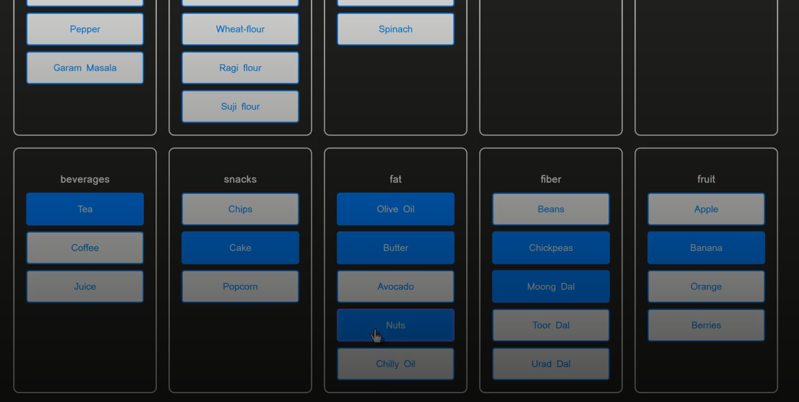

# 🧞 MealGenie

**MealGenie** is an AI-powered meal prep assistant that transforms your grocery list into personalized meal plans. It intelligently categorizes your ingredients and generates recipes for **breakfast, lunch, and dinner** — helping you save time, reduce waste, and eat smarter.

## ✨ Features

- 🛒 **Smart Grocery Categorization**  
  Organizes your ingredients into nutritional groups for better planning.

- 🤖 **AI-Generated Recipes**  
  Automatically creates 3 balanced meals per day using your existing groceries.

- 🍽️ **Personalized Meal Plans**  
  Suggests meals based on what you already have — no more unused ingredients.

- 🧠 **Efficiency Focused**  
  Helps you plan faster, eat healthier, and reduce food waste.

## 🚀 Tech Stack

- **Frontend**: React / Next.js *(optional based on your setup)*
- **Backend**: Node.js, Express
- **AI Integration**: OpenAI API or custom LLM prompts
- **Database**: MongoDB (Dockerized)
- **Authentication**: JWT *(if applicable)*
- **Dev Tools**: Docker, GitHub Actions, Postman, etc.

## 📸 Demo

> 📽️ Watch MealGenie in action:

)

> _Click the image above to watch the full demo on Google Drive._
